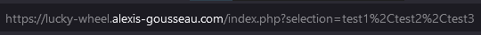
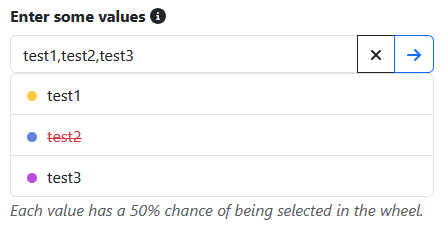

---
layout:
  title:
    visible: true
  description:
    visible: false
  tableOfContents:
    visible: true
  outline:
    visible: true
  pagination:
    visible: true
---

# 🛞 Explanation

Once the project has been set up, you can access the project home page:


Lucky Wheel - home page link


When you arrive on this page, you will be confronted with a simple text field.

## Values

To make the wheel work, you need to enter values in a specific format, which corresponds to a concatenation of words separated by a comma. It's a simple, user-friendly way of entering multiple pieces of information at the same time.

<figure><figcaption>
Lucky Wheel - entering values
</figcaption></figure>

Once the values have been entered and the form sent, the same information is retrieved via the _**selection**_ parameter in the url, given that the sending method is GET. In this way, the user can save or share the link with the values already entered, and spin the wheel directly.

<figure><figcaption>
Lucky Wheel - url parameter
</figcaption></figure>

## Chart

Once the values have been entered and sent, the graph is constructed using them, and the user can spin the wheel of fortune by clicking on the central _**SPIN**_ button.

<figure><figcaption>
Lucky Wheel - chart of the wheel
</figcaption></figure>

When this action is executed, a rotation is applied not to the graphic in the canvas, but rather to the canvas itself, to give the illusion that the wheel is rotating.

At this stage of the project, I found it a shame to have to correct the values entered to obtain a new wheel with the correct information. That's why I added a system for managing these values, allowing the user to activate or deactivate one of them with a single click, and then update the wheel of luck.

<figure><figcaption>
Lucky Wheel - values manager
</figcaption></figure>

Since only one person worked on it, project management was necessary to centralize ideas, bugs and evolutions.
